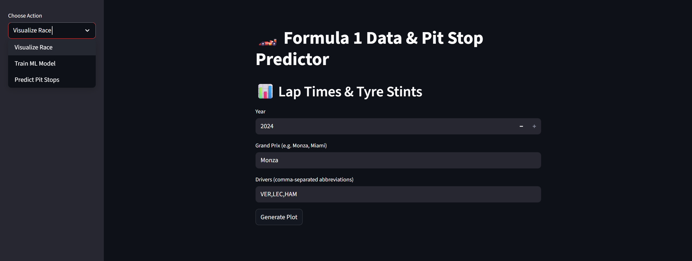
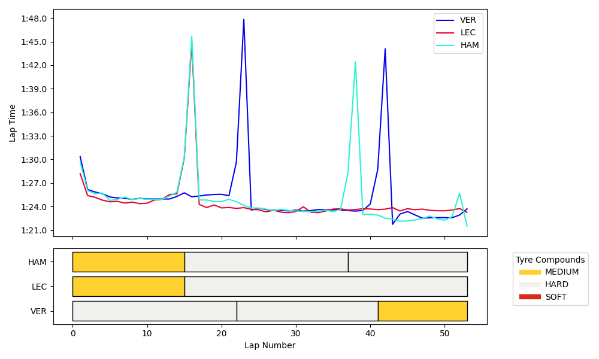
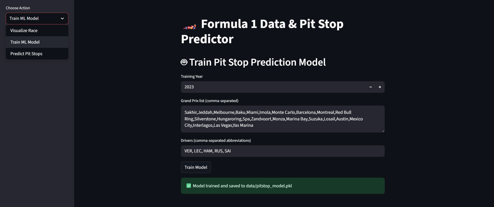
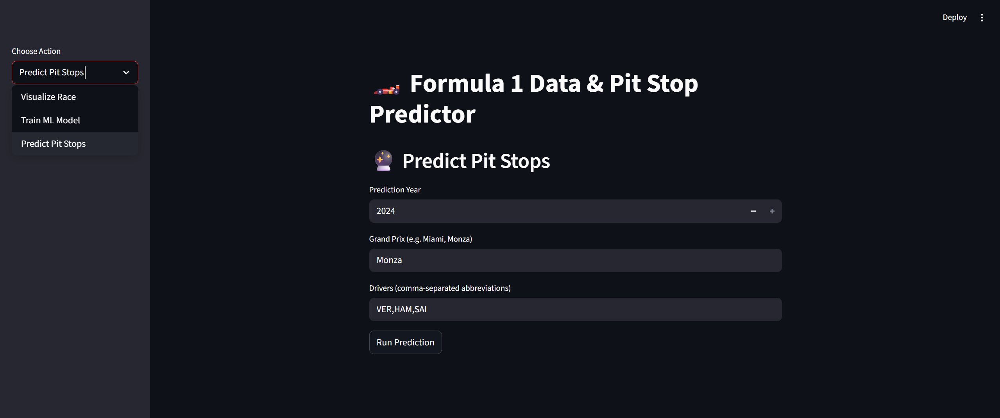
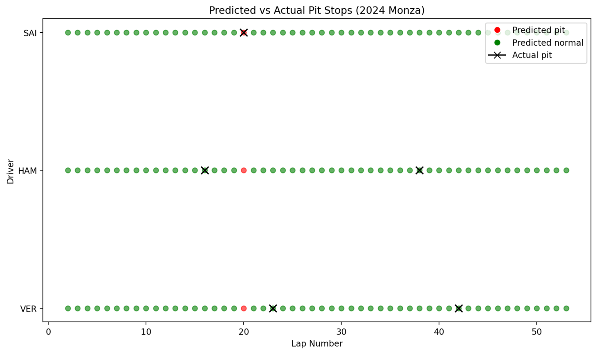

# 🚀 Telemetry Strategy Engine: Predicting Optimal F1 Pit Stops with Machine Learning

## Overview

Telemetry Strategy Engine is a comprehensive web application that not only visualizes telemetry data from Formula 1 races but also employs machine learning to predict optimal pit stop timings for drivers across various race tracks. This project integrates data processing, machine learning, and interactive visualization to assist teams in making data-driven strategic decisions during races.

## 📸 Demo











## 📦 Installation

Clone the repository:
```bash
git clone https://github.com/PaderinaViola/telemetry-strategy-engine.git
cd telemetry-strategy-engine
pip install -r requirements.txt
```
## 🛠 Usage

Load the data:
```bash
python data_loader.py
```
Start the main application:
```bash
python main.py
```
Launch the Streamlit interface:
```bash
streamlit run main.py
```
## ✨ Key Features

- **Data Processing Pipeline:** Load, clean, and transform telemetry data efficiently with Pandas and NumPy.

- **Interactive Dashboard:** Explore data with sortable, filterable tables using Streamlit.

- **Visual Insights:** Generate bar charts, pie charts, and summary statistics with Matplotlib and Plotly.

- **User-Friendly Interface:** Responsive and intuitive design for fast and easy data exploration.

## 🧰 Tech Stack

- **Python 3.13.7** – Core application logic and data processing.

- **Streamlit** – Interactive web interface for visualization and exploration.

- **Pandas & NumPy** – Efficient data manipulation and computation.

- **Matplotlib & Plotly** – Charts and interactive data visualizations.